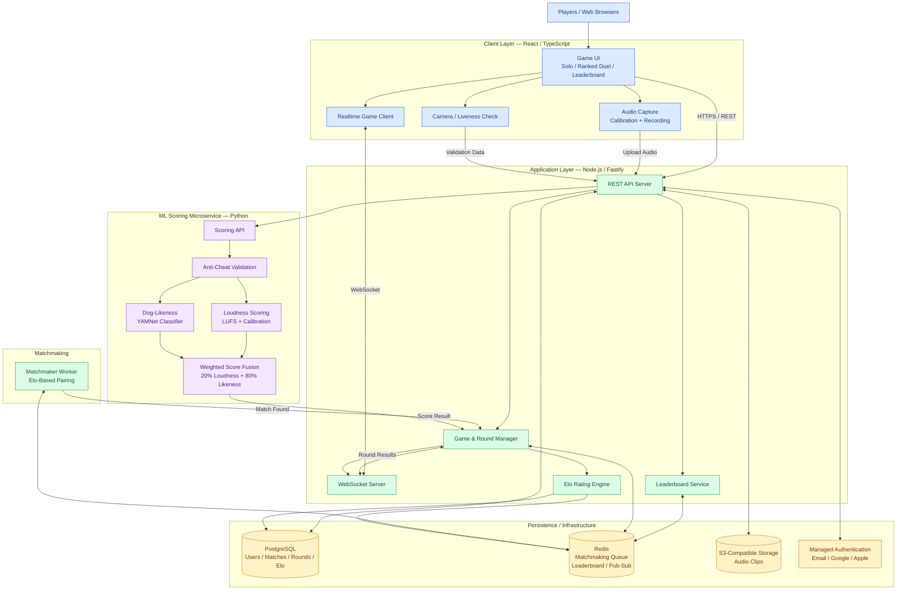

```mermaid
flowchart TB
    USER["Players / Web Browsers"]

    subgraph CLIENT["Client Layer — React / TypeScript"]
        WEB["Game UI<br/>Solo / Ranked Duel / Leaderboard"]
        AUDIO["Audio Capture<br/>Calibration + Recording"]
        CAMERA["Camera / Liveness Check"]
        WSCLIENT["Realtime Game Client"]
    end

    subgraph APPLICATION["Application Layer — Node.js / Fastify"]
        API["REST API Server"]
        REALTIME["WebSocket Server"]
        GAME["Game & Round Manager"]
        ELO["Elo Rating Engine"]
        LB["Leaderboard Service"]
    end

    subgraph WORKER["Matchmaking"]
        MATCH["Matchmaker Worker<br/>Elo-Based Pairing"]
    end

    subgraph SCORING["ML Scoring Microservice — Python"]
        SCOREAPI["Scoring API"]
        VALIDATE["Anti-Cheat Validation"]
        LOUD["Loudness Scoring<br/>LUFS + Calibration"]
        YAMNET["Dog-Likeness<br/>YAMNet Classifier"]
        FUSION["Weighted Score Fusion<br/>20% Loudness + 80% Likeness"]
    end

    subgraph DATA["Persistence / Infrastructure"]
        POSTGRES[("PostgreSQL<br/>Users / Matches / Rounds / Elo")]
        REDIS[("Redis<br/>Matchmaking Queue<br/>Leaderboard / Pub-Sub")]
        S3[("S3-Compatible Storage<br/>Audio Clips")]
        AUTH["Managed Authentication<br/>Email / Google / Apple"]
    end

    USER --> WEB
    WEB --> AUDIO
    WEB --> CAMERA
    WEB --> WSCLIENT

    WEB -->|"HTTPS / REST"| API
    WSCLIENT <-->|"WebSocket"| REALTIME

    API <--> AUTH
    API --> GAME
    API --> LB
    GAME <--> REALTIME

    API <--> POSTGRES
    LB <--> REDIS
    GAME <--> REDIS
    MATCH <--> REDIS
    MATCH -->|"Match Found"| GAME

    AUDIO -->|"Upload Audio"| API
    CAMERA -->|"Validation Data"| API
    API --> SCOREAPI

    SCOREAPI --> VALIDATE
    VALIDATE --> LOUD
    VALIDATE --> YAMNET
    LOUD --> FUSION
    YAMNET --> FUSION

    FUSION -->|"Score Result"| GAME
    GAME --> ELO
    ELO --> POSTGRES
    ELO --> REDIS

    API <--> S3
    GAME -->|"Round Results"| REALTIME

    classDef client fill:#dbeafe,stroke:#2563eb,color:#1e3a8a
    classDef backend fill:#dcfce7,stroke:#16a34a,color:#14532d
    classDef ml fill:#f3e8ff,stroke:#9333ea,color:#581c87
    classDef data fill:#fef3c7,stroke:#d97706,color:#78350f

    class USER,WEB,AUDIO,CAMERA,WSCLIENT client
    class API,REALTIME,GAME,ELO,LB,MATCH backend
    class SCOREAPI,VALIDATE,LOUD,YAMNET,FUSION ml
    class POSTGRES,REDIS,S3,AUTH data
```
